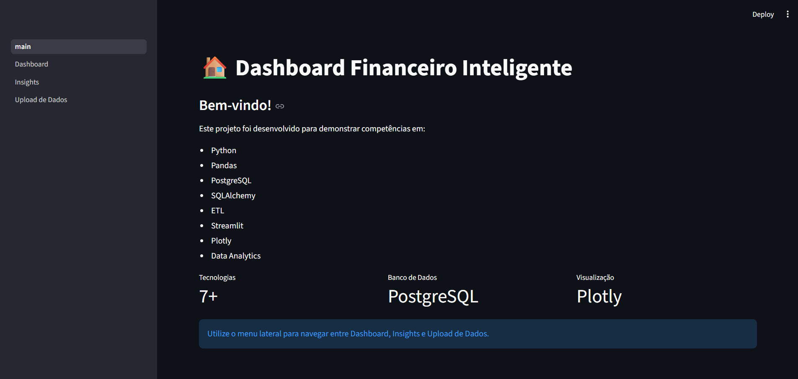
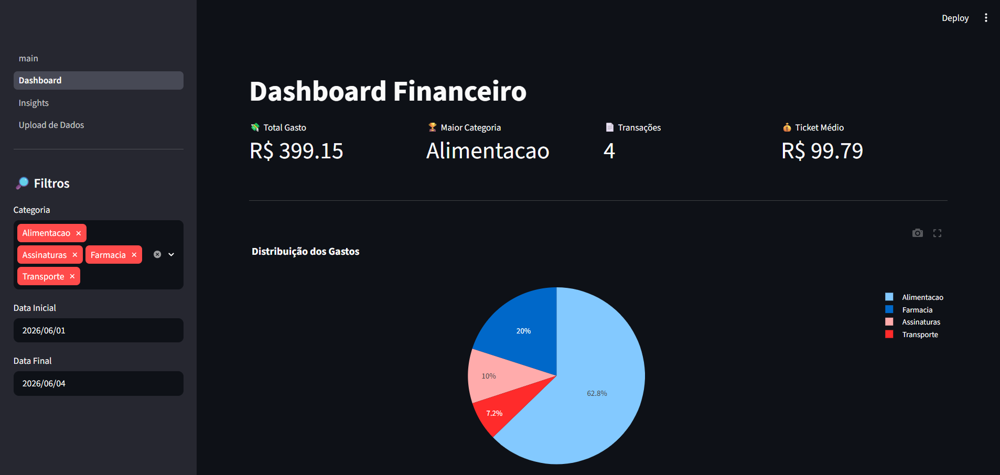
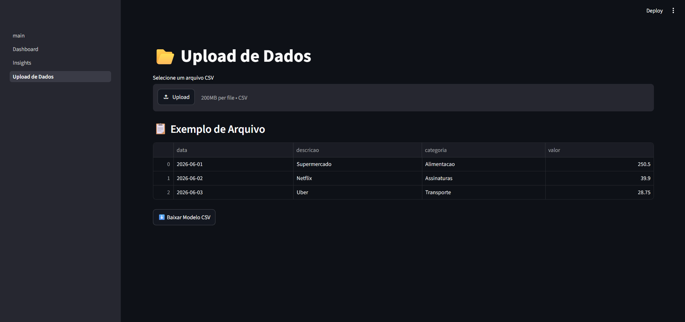
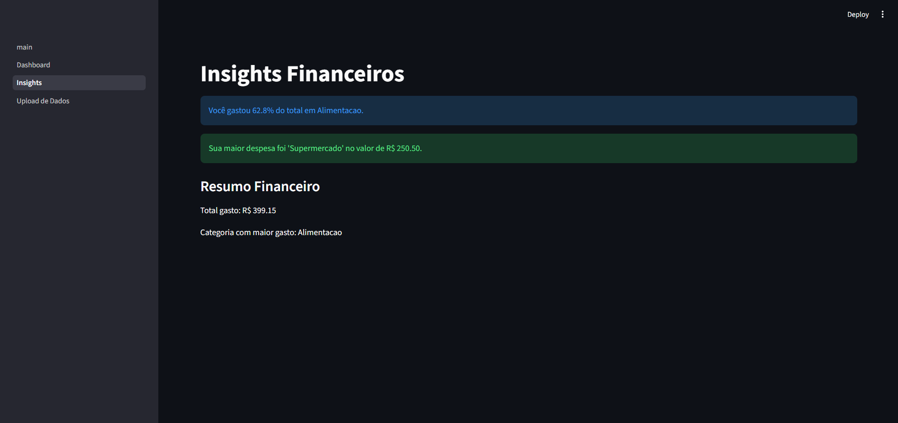

# 💰 Dashboard Financeiro Inteligente

Aplicação desenvolvida em Python para análise de gastos pessoais a partir de arquivos CSV, utilizando um pipeline ETL completo, banco de dados PostgreSQL e visualizações interativas com Streamlit.

## 🚀 Objetivo

O Dashboard Financeiro Inteligente permite que usuários importem seus gastos financeiros por meio de um arquivo CSV e obtenham automaticamente análises, indicadores e visualizações que auxiliam na compreensão dos hábitos de consumo.

O projeto foi desenvolvido para praticar conceitos de:

* Engenharia de Dados
* ETL (Extract, Transform, Load)
* Banco de Dados Relacional
* Business Intelligence
* Visualização de Dados
* Desenvolvimento de Aplicações Data-Driven

---

## 🛠 Tecnologias Utilizadas

### Linguagens e Bibliotecas

* Python
* Pandas
* SQLAlchemy
* Psycopg2
* Plotly
* Streamlit
* Python-dotenv

### Banco de Dados

* PostgreSQL

### Controle de Versão

* Git
* GitHub

---

## 🏗 Arquitetura do Projeto

```text
dashboard-financeiro-inteligente/

├── app/
│   ├── main.py
│   └── pages/
│       ├── Dashboard.py
│       ├── Insights.py
│       └── Upload_Dados.py
│
├── database/
│   ├── connection.py
│   ├── create_tables.py
│   └── schema.sql
│
├── etl/
│   ├── extract.py
│   ├── transform.py
│   └── load.py
│
├── services/
│   └── analytics.py
│
├── data/
│
├── .env
├── requirements.txt
└── README.md
```

---

## 🔄 Pipeline ETL

### Extract

Leitura de arquivos CSV enviados pelo usuário.

### Transform

* Conversão de datas
* Remoção de espaços extras
* Padronização de categorias
* Remoção de registros duplicados
* Remoção de valores inválidos

### Load

Persistência dos dados em banco PostgreSQL utilizando SQLAlchemy.

---

## 📊 Funcionalidades

### Dashboard

* Total gasto
* Categoria com maior gasto
* Total de transações
* Ticket médio
* Distribuição de gastos por categoria
* Gastos por categoria
* Evolução temporal dos gastos
* Ranking das maiores despesas

### Insights

* Categoria dominante
* Maior despesa registrada
* Resumo financeiro

### Upload de Dados

* Upload de arquivos CSV
* Processamento ETL automático
* Armazenamento em PostgreSQL

---

## 📁 Estrutura Esperada do CSV

```csv
data,descricao,categoria,valor
2026-06-01,Supermercado,Alimentacao,250.50
2026-06-02,Netflix,Assinaturas,39.90
2026-06-03,Uber,Transporte,28.75
```

---

## 📁 Dataset de Exemplo

O projeto inclui um arquivo CSV de exemplo localizado em:

```text
data/raw/gastos.csv
```

Esse arquivo pode ser utilizado para testar rapidamente o pipeline ETL e as funcionalidades do dashboard.

## ⚙️ Configuração do Ambiente

### 1. Clonar o Repositório

```bash
git clone https://github.com/luanamcrs/dashboard-financeiro-inteligente.git
```

### 2. Criar Ambiente Virtual

```bash
python -m venv .venv
```

### 3. Ativar Ambiente

Windows:

```bash
.venv\Scripts\activate
```

### 4. Instalar Dependências

```bash
pip install -r requirements.txt
```

---

## 🔐 Variáveis de Ambiente

Crie um arquivo `.env` na raiz do projeto:

```env
DB_USER=postgres
DB_PASSWORD=sua_senha
DB_HOST=127.0.0.1
DB_PORT=5432
DB_NAME=dashboard-financeiro
```

---

## ▶️ Executando o Projeto

```bash
streamlit run app/main.py
```

---

## 📈 Aprendizados

Durante o desenvolvimento deste projeto foram aplicados conceitos de:

* Manipulação de dados com Pandas
* Consultas SQL
* Integração Python + PostgreSQL
* Construção de pipelines ETL
* Desenvolvimento de dashboards interativos
* Organização de projetos em camadas
* Boas práticas com variáveis de ambiente

---

## 👩‍💻 Autora

Luana Monteiro

Estudante de Tecnologia em Informática para Negócios — FATEC São Bernardo do Campo

Interesses:

* Dados
* Analytics
* Inteligência Artificial
* Automação de Processos
* Backend Python

## 📸 Demonstração

### Home



### Dashboard



### Upload de Dados



### Insights

